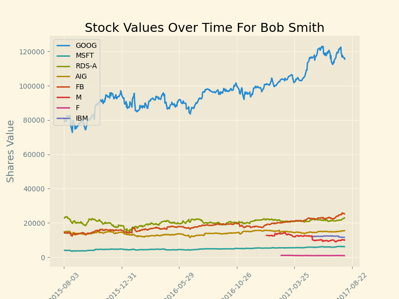
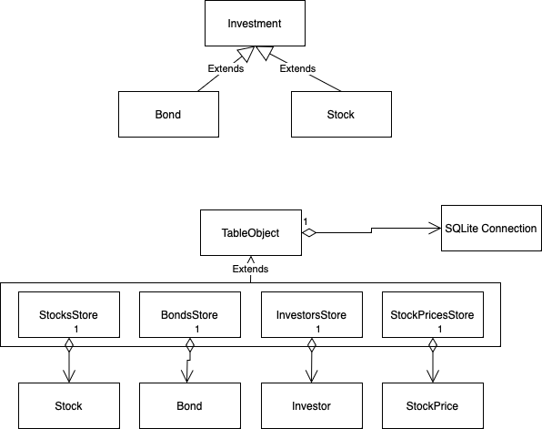

# Stocks Price Havester with Visualization

## Description
This script generates a line plot for stock values in a portfolio.

Steps:
1. Sets up a database in memory
2. Creates an investor in the db
3. Imports stocks and bonds data from files
4. Parses data to class and persists it to db
5. Imports stock pricing data to db
6. Queries investor stocks
7. Queries historical stock pricing for each stock symbol in portfolio
8. User `matplotlib` to generate visualization of data
9. Saves report for investor to `out_files/` for investor

### Sample Visualization


## Running Script
```bash
# installing packages
pip install -r requirements.txt
# running script OSX
python3 main.py
```

## Object Hierarchy


## Libraries
- `matplotlib` Used for create data visualizations
- `SQLite3` User for storing and querying local data

## Datasources
All files provided from course material in canvas
- `AllStocks.json` Stock pricing data
- `Lesson6_Data_Bonds.csv` Bonds data for single investor
- `Lesson6_Data_Stocks.csv` Stocks data for single investor

**Note: There was a typo fixed in the `Lesson6_Data_Stocks.csv` where stock GOOG was GOOGL**


## Harvesting Stock data
Stock data can be downloaded using [polygon.io](https://polygon.io/docs/stocks/get_v1_open-close__stocksticker___date) for open and close prices. You can register for a 
free account [here](https://polygon.io/stocks).

**Note: Using the free account limits request to 5 per minute** 
### Harvesting Price data
```bash
# OSX bash command
python3 stock_price_harvester.py <api-key>
```
